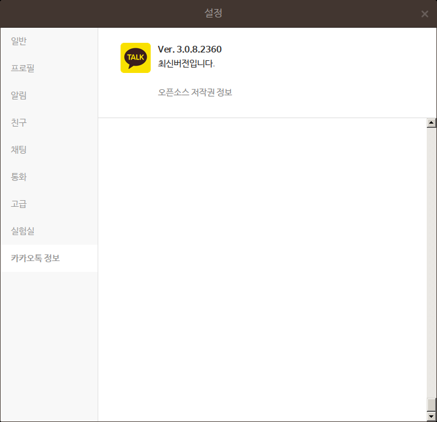

kakaotalk-env
===

This is the wrapper script to start and quit the Kakao Talk in the Debian Linux.

## Preparation

* Install Wine with root

```
dpkg --add-architecture i386 && apt-get update && apt-get install wine wine32 winbind
```

* Setup the basic Korean font for wine
`emacs ~/.wine/system.reg`

```
"MS Shell Dlg"="NanumGothic"
"MS Shell Dlg 2"="NanumGothic"
```


## Download the latest Kakao Talk for Windows

https://downloadkakaotalk.com/kakao-talk-for-windows.html

```
wget http://app.pc.kakao.com/talk/win32/KakaoTalk_Setup.exe
````

* Install the downloaded Kakao Talk with wine

```
wine KakaoTalk_Setup.exe
```

* Select **Korean**  even if the main window fonts are totally broken. One cannot see the text on buttons, but one should know which buttons are following:

```
1. Next
2. Next
3. Uncheck all > Install 
4. Uncheck Run KakaoTalk > Finish
```

* Login with Kakao account

* Go to the Settings, Select one of `Nanum` family fonts. The Kakao Talk will ask to restart it. 

* Restart


## Commands

* Start it
```
bash kakaotalk.bash start
```


* Stop it
```
bash kakaotalk.bash start
```

## Screenshots


||
| :---: |
|**Figure 1** Kakao Talk Setting. |


||
| :---: |
|**Figure 2** Kakao Talk Setting Information. |


||
| :---: |
|**Figure 3** Kakao Talk and Debian System Information. |
